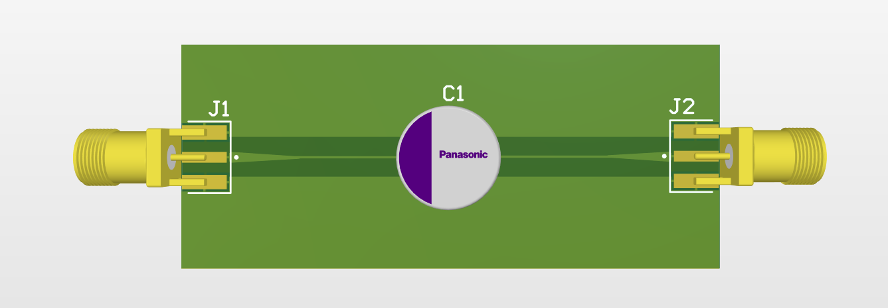

# RFTPCapTH
## Description
- RF test pad for through hole capacitor, designed in Altium Designer.
- Board dimension: 60mm x 25mm
- RF trace: impedance control at 50Ω, ~0.5mm width
## Design Updates
### V1.0 - 6/17/2026
- Initial board design
- Implemented tapered transition from pin pad to RF trace

